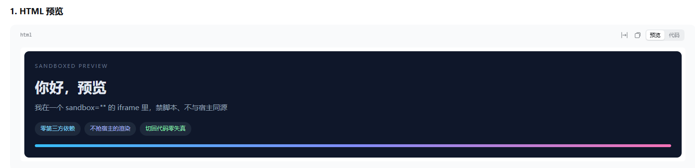
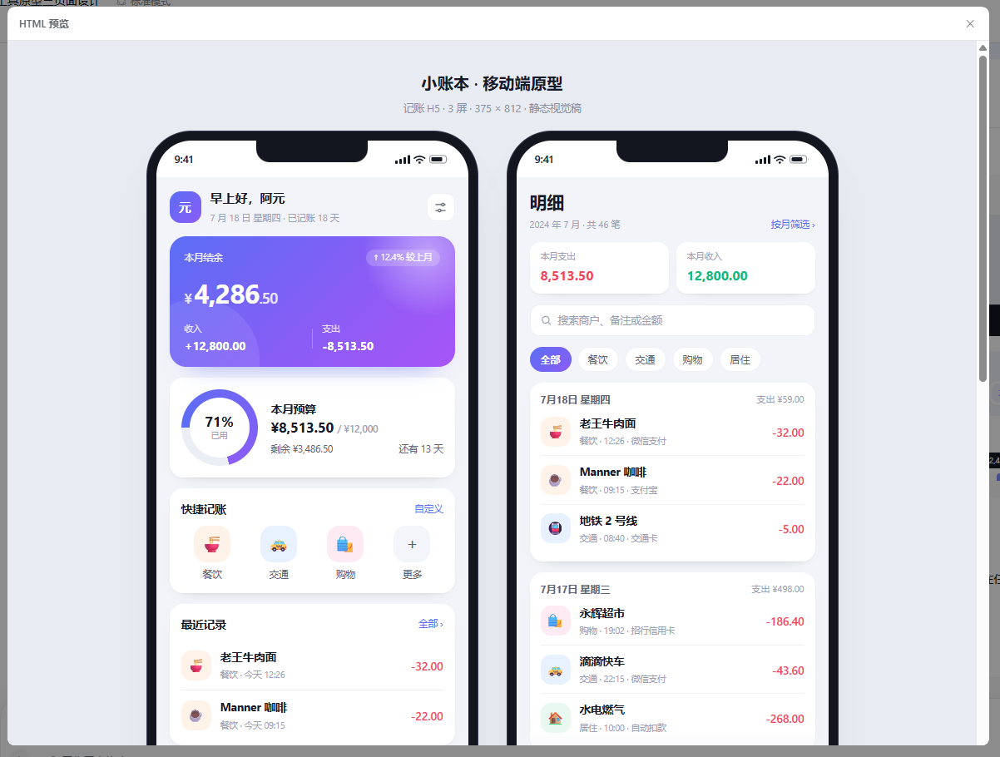
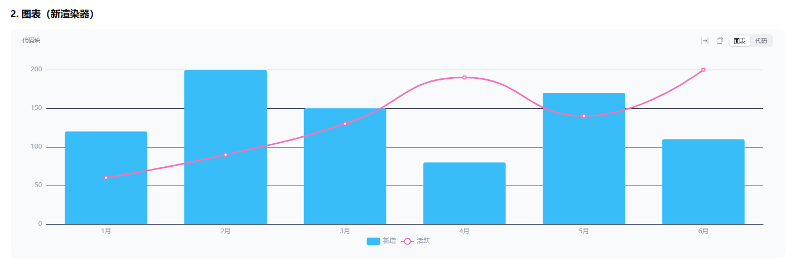
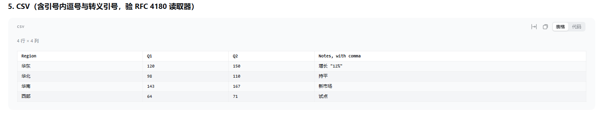
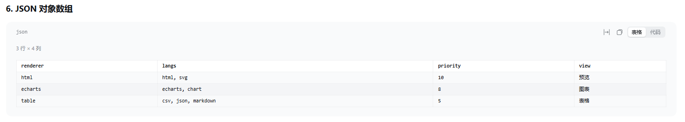
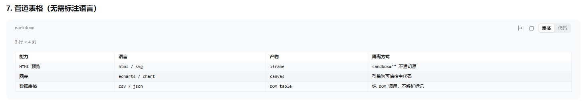

# dsh-viewer-kit

给 [DeepSeek Harness](https://deepseek-harness.github.io/deepseek-harness/)（`dsh`）对话窗口用的
**可插拔内容渲染层**：让代码块除了「源码」之外还能有「渲染结果」，两者一键切换。

> **这是一个 vibe coding 项目。** 代码绝大部分由 AI 在对话中生成，作者负责提需求、验证结果、
> 以及在它跑偏时把方向纠回来。它能工作、有测试，但**依赖前请先读代码** ——
> 不要假设它有常规开源项目的打磨程度。版本号 < 1.0，配置键不保证稳定。

---

## 1. 功能与配置

### 它做什么

| 围栏 | 切换 | 渲染结果是怎么来的 |
|---|---|---|
| `html` `svg` | 预览 / 代码 | 沙箱 iframe 真实渲染，默认禁脚本；可**放大**成弹窗看全文 |
| `csv` `tsv` | 表格 / 代码 | 自己实现 RFC 4180 解析，DOM 建表（不解析标记）；表头吸顶 |
| `json` | 表格 / 代码 | 只认**对象数组**；对象不是表 |
| `markdown` | 表格 / 代码 | 只认**整个围栏就是一张管道表**，否则原样 |
| `echarts` `chart` | 图表 / 代码 | 模型只写 option 的 JSON，引擎按需加载 |
| 其它（`py` …） | — | **完全不碰**，DSH 什么样就什么样 |

**只作用于「会话」标签页。** 轨迹标签页也渲染 `.md-code-block`，但它的 DOM 不带任何
`data-chat-*` 属性而会话区带 —— 边界建在这个实测差异上，不需要知道 shell 如何组织标签页。

> **`echarts` 围栏不需要写 HTML。** 只写 ECharts 的 option JSON 就够了，不用引 CDN、
> 不用 `<script>`、也不需要打开 `htmlAllowScripts` —— 引擎是插件自己按需加载的代码。

### 实际效果

以下截图取自 DSH Desktop `0.2.0-rc.2` 真实运行，未做修饰。

**`html`** —— 沙箱 iframe 渲染，高度贴合内容：



**`html` · 放大** —— 点右上角图标，同一个文档进弹窗，按视口高度铺开：



**`echarts`** —— 模型只写 option 的 JSON，引擎作为独立文件按需加载：



**`csv`** —— 自实现 RFC 4180：引号内的逗号与转义引号不会被拆成两格：



**`json`** —— 只认对象数组：



**`markdown`** —— 只认整张管道表：



### 高度与「看全内容」

三个渲染器里**只有两个物理上必须封顶**，因为它们的内容高度无法从 DOM 推出：

| 渲染器 | 封顶 | 为什么必须 |
|---|---|---|
| `html` | `maxPreviewHeight` 320 | `<iframe>` 是替换元素，高度**永不来自内部文档**；`max-height` 只能限制默认的 150px。只能测出来再封顶 |
| `echarts` | `chartHeight` 360 | canvas 在 auto 高度盒子里渲染成 **0** 高 |
| `table` | `maxTableHeight` 480 | **不是必须** —— 表格能自然撑开。封顶是为了不把对话拉长 |

封顶和逃生口是**成对**的：只封顶不给出路，等于拿掉"一眼看全 500 行"的能力，
而那恰恰是没封顶时唯一能看到全部的方式。所以被认领的块会带一个**放大图标**
（与 banner 里 DSH 自己的复制按钮同款）：

- **表格** —— 就地取消高度封顶，整张表在对话里展开。再点一次恢复。
  **表格比 `maxTableHeight` 矮时不会出现这个按钮**：那种表格本来就没被裁，取消封顶一个像素都不会变。
- **HTML 预览** —— 开一个弹窗，高度按视口的 86% 算，内容按真实高度撑开。
  短文档无滚动条、无留白；长文档只在物理上装不下时才出现滚动条。

**图表没有放大控件** —— 它有确定的 `chartHeight`，不存在"内容比框高"那种失控。

### 配置

所有可调项都是**插件配置**，写在 Loader 行的 `config` 里。改**当前 profile** 的行为：

```yaml
# $DSH_HOME/profiles/<name>/cordis.patch.yml
- id: dsh-viewer-kit
  config:
    htmlAllowScripts: true
```

用户 patch 在所有组合包层**之后**应用、按行 id 胜出，所以这样写会覆盖包内默认值。

> **改完要重启 profile，不只是刷新页面。** 配置由**宿主半体**在激活时读取并校验，
> 浏览器是启动后去取它的结果；刷新页面只会让客户端重新拉一次**同样的**结果。
> 宿主进程日志里 `host config published at /dsh-viewer-kit/config: {...}` 就是它读到的值。

| 键 | 默认 | 作用 |
|---|---|---|
| `enabled` | `true` | 总开关。`false` 后所有渲染器都不认领，代码块保持 DSH 原样 |
| `defaultToPreview` | `true` | 认领到的块默认打开**渲染结果**而不是源码 |
| `previewHeightMode` | `measure` | HTML 预览高度怎么定 —— 见下 |
| `maxPreviewHeight` | `320` | `measure`/`fit` 下是**上限**，`fixed` 下就是**框高** |
| `maxTableHeight` | `480` | 表格超过这个高度就开始**框内滚动**，表头吸顶 |
| `chartHeight` | `360` | 图表高度。必须 > 0，否则画布渲染成 0 高 |
| `htmlAllowScripts` | `false` | 允许预览里的 HTML 执行**它自己的**脚本 |
| `maxSourceBytes` | `262144` | 超过这个大小的源码保持原生代码块 |
| `disabledRendererIds` | `[]` | 关掉个别渲染器，**两层语义** —— 见下 |

**值写错了会怎样**：宿主半体**响亮报错**并拒绝这一行，而客户端半体**静默回落默认值**。
两边的严格程度故意不同，理由和排查顺序见 [`AGENTS.md`](AGENTS.md) §1。

#### 预览高度是怎么定的

| 模式 | 短内容 | 长内容 | 代价 |
|---|---|---|---|
| `measure`（默认） | 框**贴合内容**，无留白 | 顶到上限后框内滚动 | frame 需要 `allow-scripts` 跑测量脚本 |
| `fit` | 估算贴合，可能略差 | 同上 | 估算偏小时会出现滚动条 |
| `fixed` | 完整显示，**下方留白到固定高度** | 超过即滚动 | 完全可预期，但短内容必然有留白 |

**为什么默认是 `measure`：** DSH 自己的代码视图**也没有固定高度**（`<pre>` 只设了 `padding`
与 `overflow-x:auto`，高度由内容决定）。固定预览高度会让两个互相切换的视图行为不一致；
测量让预览和它旁边的代码视图保持同一种语义：内容多高就多高。

#### `disabledRendererIds` 的两层语义

同一个列表，两层，这是它容易搞错的原因：

| 写法 | 含义 | 块会怎样 |
|---|---|---|
| `['table']` | 按**渲染器 id** 关闭 | 该渲染器不再认领，块**重新交给剩下的渲染器**；没人认领就回落原生代码视图 |
| `['csv']` | 按**围栏名**关闭 | 该块**根本不进渲染器**，不管有没有渲染器认领它 |

两者会重叠：`['csv']` 和 `['table']` 都能关掉 CSV 表格，但原因不同。真正分家的是
**没有同名渲染器的语言** —— `['json']` 会让所有 `json` 块原样保留，而这是"别让 ECharts
option 被表格渲染器认领"却不点名 `echarts` 的唯一办法。

### 关于 `htmlAllowScripts`

默认关闭，所以预览里**带 `<script>` 的 HTML 不会执行**。这和 echarts 图表无关 ——
图表走 ` ```echarts ` 围栏，引擎是插件按需加载的可信代码。

打开后 frame 仍是**不透明源**，读不到宿主的 DOM / cookie / storage。变化的是：
**仅仅渲染一段内容就可能发起该内容里的网络请求**（远程图片自动加载、脚本可向任意地址发请求）。
内容本身是模型写的，泄露面基本限于模型已写出的东西 —— 但"看一眼就联网"确实是新引入的能力。

> **DSH 没有「按 schema 自动生成表单」这回事。** 本插件导出 `Config` schema 得到的是
> **校验 + 默认值 + agent 可读的 JSON Schema**，**不是**一个能点的设置界面。
> 所以配置就是上面那段 patch 文本。

### 已知限制

1. **强耦合 DSH 的内部 DOM。** 插件不注册 Slot、不重写组件，而是在 DSH 的
   `[data-code-block-content]` 旁边挂自己的节点 —— 那节点是官方 CSS 注释标注的
   "stable content node"，但它依然是**内部实现**。核对版本：**DSH Desktop `0.2.0-rc.2`**。
   DSH 升级后形状一旦改变，插件会**静默不生效**（不是崩溃）。核对入口只有一个文件：
   `src/client/dom-contract.js`，升级步骤见 §3。

2. **围栏语言名可能是空的。** DSH 的语言表是 **Shiki 内置的，不支持自定义**，
   banner 只在有高亮器时才写语言名。所以 ` ```echarts ` 拿到的标签是通用文案，
   **原始语言名在 DOM 里不存在**。插件的应对是**按内容判定**。

3. **只有会话页。** 轨迹页的代码块不会被动。

4. **行数列数有上限**（500 行 × 40 列，单元格 400 字），超出部分截断并提示。

---

## 2. 安装

```powershell
# A. 从本地目录（开发时最常用）
dsh plugin add file:E:\path\to\dsh-viewer-kit

# B. 从 tarball（适合分发给别人 / 内网）
npm pack                       # 产出 dsh-viewer-kit-0.9.0.tgz
dsh plugin add file:.\dsh-viewer-kit-0.9.0.tgz
```

装好后**重启 profile**，让宿主半体生效。

> **不要走 `github:` 直装。** 官方《[打包与安装插件](https://deepseek-harness.github.io/deepseek-harness/develop/basic/publish)》
> 明确警告：git 安装拉的是**源码不是产物**，pnpm ≥10 会拒绝运行它的 `prepare` 脚本，
> 除非用户在 profile 的 `pnpm-workspace.yaml` 里写 `allowBuilds` —— 那等于**允许该包的代码
> 在安装时于本机执行、且不在任何沙箱内**。分发预构建产物就没有这道坎。

### 确认它活着

浏览器控制台出现四行（宿主进程另有一行 `host config published at …`）：

```
[dsh-viewer-kit] renderers: html, echarts, table
[dsh-viewer-kit] waiting for the host config route
[dsh-viewer-kit] config: default view=preview, html scripts=off, max preview height=320px, chart height=360px (from defaults, host answered 404)
[dsh-viewer-kit] v0.9.0 active — N code block(s) enhanced
```

> 渲染器按**优先级**排列而非注册顺序：`html` 10 > `echarts` 8 > `table` 5。
> 括号里是配置的来源。`from host` 说明宿主半体在跑、`cordis.patch.yml` 里的值已生效；
> `from defaults, …` 说明没读到宿主配置，**所有键都是默认值** —— 原因写在括号里。

排障时用这一条命令：

```js
__DSH_VIEWER_KIT__.diagnose()
```

它区分三种"装了但没渲染"：**客户端半体没加载**（`__DSH_VIEWER_KIT__` 为 `undefined`）、
**接缝没找到代码块**、**找到了但没有渲染器认领**。

---

## 3. 开发

**改动本仓库请看 [`AGENTS.md`](AGENTS.md)** —— 命令、架构不变量、单一真相来源、
房子规矩、升级 DSH 的步骤都在那里。README 只留使用者需要的东西。

```powershell
pnpm install
pnpm run check        # 类型检查 → 构建 → 128 项测试 → 产物激活复现 → 宿主契约探针
pnpm run release      # check + 打包自检，完整发布门禁
```

需要 **Node ≥ 22**（tsdown 用到 `Promise.withResolvers`），而且**要用版本管理器显式选定** ——
`pnpm run` 是用 PATH 上的 `node` 拉起子进程的，PATH 上是旧版会直接失败且报错指向 tsdown：

```powershell
fnm exec --using=24 -- pnpm run check
```

**改完要重新构建再提交**：`client/` 是提交进库的产物（DSH 激活时会直接读这个文件，
缺了它 entry 就激活失败）。

---

## 4. 其他

### 安全

模型产出的 HTML 属于**不可信输入**。预览一律走 `<iframe sandbox>`：

- **任何配置下都不会同时给 `allow-scripts` 和 `allow-same-origin`**（那才是真正的逃逸）；
- `measure` 模式的 frame 带 `allow-scripts`（跑测量脚本），模型脚本由 **CSP nonce 策略**
  拒绝；`fit` / `fixed` 模式下 frame 是 `sandbox=""`，**零脚本权限**；
- `referrerpolicy="no-referrer"`；
- 表格视图用 DOM API 建节点，**不解析模型产出的标记**；
- 不提供"在新标签页打开"—— 那会用 `blob:` URL 以宿主同源执行，恰好绕开全部沙箱保证。

已知的残留风险：渲染一段 HTML **可以发起该内容里的网络请求**（远程图片、CSS），
这一条在**所有**配置下都成立，因为浏览器必须加载子资源才能排版。

### 它是怎么工作的

不注册任何 Slot、不重写任何组件，只在 DSH 自己标注为 "stable content node" 的节点上
**追加**我们自己的节点；切换视图只改一个我们自己的属性，原生 `<pre>` 一个字节都没动过。
架构与取舍的完整记录在 [`docs/01-architecture.md`](docs/01-architecture.md)，
新增渲染器见 [`docs/02-renderer-authoring.md`](docs/02-renderer-authoring.md)。

### 升级 DSH 之后

1. 核对 `src/client/dom-contract.js` 里引用的 DOM 形状 —— **只有这一个文件**需要改；
2. `pnpm run check`：类型检查、夹具与断言会告诉你变了什么；
3. 重新构建并拷贝覆盖（步骤见 [`AGENTS.md`](AGENTS.md) §3）。

### 许可

MIT
